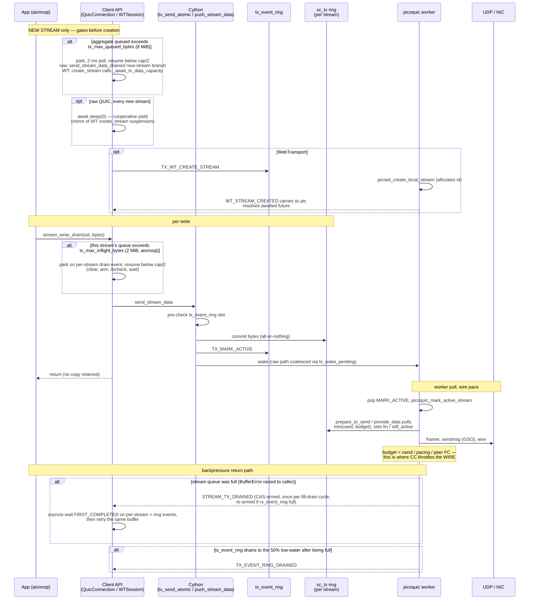
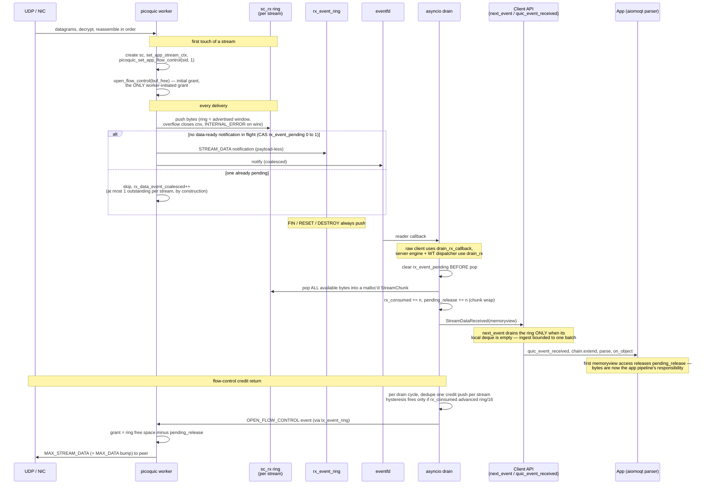

# DATAFLOW — TX/RX data paths and flow control

How bytes move between the application API and the NIC, in both
directions, and every mechanism that throttles them. Code references
name files and functions — line numbers move, names don't.
Companion: aiomoqt sits above
the client API shown here; its per-stream policy parameter is noted
where it participates.

---

## 1. Architecture — threads and rings

Each `TransportContext` runs **two threads**: the asyncio loop
(application side) and a picoquic worker (network side, one per
transport, started by `picoquic_start_network_thread`). They share no
locks; all crossing happens over four kinds of SPSC rings plus an
eventfd:

| Ring | Direction | Carries | Size (default) |
|---|---|---|---|
| `tx_event_ring` | asyncio → worker | commands: MARK_ACTIVE, FC credit, WT control. Fixed ~64 B entries, no stream payload (pull model) | 2048 entries (`AIOPQUIC_TX_EVENT_RING_CAP_DEFAULT`, `callback.h`) |
| `rx_event_ring` | worker → asyncio | notifications: data-ready, FIN, RESET, DESTROY, drain wakes. Payload-less for stream data | 16384 entries (`AIOPQUIC_RX_EVENT_RING_CAP_DEFAULT`, `callback.h`) |
| `sc->tx` | asyncio → worker | one per stream: outbound payload bytes | 4 MiB (`AIOPQUIC_TX_DATA_RING_CAP_DEFAULT`, `callback.h`); raw QUIC overridable via `stream_ring_cap` |
| `sc->rx` | worker → asyncio | one per stream: inbound payload bytes | sized to the advertised per-stream FC window (= `max_stream_data`, pow2-rounded) |

Worker→asyncio wakeups go through one eventfd
(`loop.add_reader`); asyncio→worker through
`picoquic_wake_up_network_thread`. Both directions coalesce:
`tx_wake_pending` dedupes producer wakes (raw-QUIC sends and the FC
push path; **WT sends wake unconditionally** — `push_stream_data`, `_transport.pyx`),
and `rx_notify_pending` dedupes eventfd writes (`aiopquic_notify_rx`, `callback.h`).

WebTransport shares everything above: `wt_session->bridge` *is* the
transport's `aiopquic_ctx_t` — same event rings, same eventfd
(`st_aiopquic_wt_session_t.bridge`, `h3wt_callback.h`). WT differs only in callbacks and
per-stream identity (§6).

---

## 2. TX — application → NIC



Key contracts:

- **All-or-nothing commit** — a retryable failure (`BufferError`)
  commits zero bytes; retrying the same buffer never duplicates wire
  bytes (`tx_send_atomic`, `_transport.pyx`).
- **Clear-before-send** — the producer clears its asyncio Events
  *before* the send attempt so a worker fire racing the send is
  captured by the subsequent wait (`send_stream_data_drained`, `connection.py`).
- **Lost-wake immunity** — every drain-event fire is CAS-guarded with
  re-arm on `rx_event_ring`-full (per-stream fire in `prepare_to_send` and
  `aiopquic_maybe_fire_tx_event_ring_drained`, `callback.h`), so
  a wake is delayed, never lost.
- Close/destroy paths set every parked Event so waiters exit cleanly
  (`_handle_raw_event` close/destroy branches, `connection.py`).

### TX backpressure layers

Layered from coarsest to finest; whichever binds first governs.
Latency contributed by a queue = its depth ÷ drain rate.

| # | Layer | Trigger | Park / resume | Scope |
|---|---|---|---|---|
| 1 | `tx_max_queued_bytes` (4 MiB, `QuicConfiguration`) | aggregate `pushed − pulled − discarded` over cap | park at stream creation; resume < cap/2; 2 ms poll | all streams — the only bound short-stream churn cannot bypass |
| 2 | `tx_max_inflight_bytes` (1 MiB, aiomoqt `MOQTPeer`) | one stream's `sc->tx` used over cap | park mid-stream on drain event; resume < cap/2 | per stream — fairness + binds on long-lived streams |
| 3 | `sc->tx` ring full (4 MiB) | commit doesn't fit | `BufferError` → dual-event wait → retry | per stream, hard |
| 4 | `tx_event_ring` pressure | > 90% → hard wait; > 50% → post-send `sleep(0)` | ring-drained event at ≤ 50% low-water | connection, command channel |

Sender-side mirror of QUIC's receive-side model:
`tx_max_inflight_bytes` ↔ MAX_STREAM_DATA, `tx_max_queued_bytes` ↔
MAX_DATA. Aggregate counters:
`tx_data_bytes_pushed/pulled/discarded` (`stream_ctx.h`);
`discarded` credits bytes abandoned at stream teardown so the gate
cannot drift.

---

## 3. RX — NIC → application



### RX flow-control model

- **Per-stream window = the ring.** `max_stream_data` (16 MiB
  default via `QuicConfiguration`) is both the advertised
  MAX_STREAM_DATA *and* the `sc->rx` allocation, so the spec-permitted
  worst case (peer fills the whole window) fits by construction. A
  peer that overruns it is closed.
- **Replenishment is exclusively consumer-driven.** The worker grants
  once at first touch; afterwards only the asyncio drain pushes
  credit, gated by per-cycle dedupe + the ring/16 hysteresis
  (`_push_fc_credit`, `_transport.pyx`). There is no worker-side extension
  loop.
- **`fc_credit_pushed = 0` under stream churn is normal.** Every
  fresh stream starts with a full initial window; streams shorter
  than ring/16 never trip the hysteresis. Replenishment only matters
  for long-lived streams.
- **`pending_release` throttles only untouched bytes.** It is
  released at the consumer's *first* buffer access
  (`StreamChunk.__getbuffer__` via `_release_fc`, `_transport.pyx`) — once a
  memoryview exists, bounding memory
  is the application's job (parser caps, aiomoqt chain commit
  cadence), not QUIC FC.
- **Consumer-lag stall chain**: consumer busy → `next_event` skips
  ingest (local queue non-empty) → `sc->rx` fills → `rx_consumed`
  stalls → no credit push → peer exhausts its grant and stops sending
  *on that stream*. Nothing blocks the asyncio loop; data events stay
  bounded at one per live stream; the eventfd re-arms whenever
  entries remain (`aiopquic_clear_rx`, `callback.h`), so no lost wakeups.
- **MAX_DATA (connection level) is picoquic-automatic**: extended at
  frame *receipt* when `2 × offset_received > maxdata_local`
  (picoquic `sender.c`) — it never reflects application backpressure.
  Per-stream FC is the only inbound app-backpressure mechanism.

---

## 4. Saturation vs below

**Below saturation** (producer rate ≤ wire rate ≥ consumer rate):
no gate engages, no drain event is ever armed, FC credit flows ahead
of need. The only active mechanics are the two wake coalescers.
Counter signature: `*_arms = 0`, `rx_event_drops = 0`,
`tx_data_bytes_queued` ≈ 0, `wake_skipped_coalesced` ≫ `wake_calls`.

**At saturation**, the binding constraint by direction:

- **TX, unpaced producer**: the aggregate gate
  (`tx_max_queued_bytes`) parks producers at stream rollover;
  standing queue oscillates in the [cap/2, cap] band, so
  steady-state e2e latency ≈ `0.75 × cap ÷ drain rate` (4 MiB ≈ 8 ms
  at ~3 Gbps). The floor below the aggregate cap is the rollover
  overshoot `P × min(per-stream cap, bytes-per-stream)`; the
  per-stream cap (`tx_max_inflight_bytes`) governs below that floor.
- **RX, slow consumer**: per-stream FC stalls the peer at the
  unreplenished window; bytes bounded at `ring × live streams`,
  events at one per stream.
- **The wire itself**: CC (cwnd/pacing) governs between the two —
  visible in `path_quality` (`cwin`, `bytes_in_flight`, `pacing`),
  not in any aiopquic queue. On loopback, BBR's max-filter reads
  bursty CPU service as high bandwidth; cwnd, not pacing, is the real
  governor there.

---

## 5. Configuration parameters

| Parameter | Default | Bounds |
|---|---|---|
| `QuicConfiguration.max_data` | 16 MiB | cnx-level inbound FC (initial; picoquic auto-extends) |
| `QuicConfiguration.max_stream_data` | 16 MiB | per-stream inbound window AND `sc->rx` size |
| `QuicConfiguration.stream_ring_cap` | 4 MiB | per-stream `sc->tx` hard cap |
| `QuicConfiguration.tx_max_queued_bytes` | 4 MiB (0/None off) | aggregate outbound queue, all streams |
| `QuicConfiguration.max_streams_uni/bidi` | 512 | initial MAX_STREAMS credit |
| `QuicConfiguration.event_ring_capacity` | None → 2048/16384 | both event rings |
| `QuicConfiguration.idle_timeout` | 30 s | QUIC idle timeout |
| `QuicConfiguration.congestion_control_algorithm` | "bbr1" | CC algorithm |
| aiomoqt `tx_max_inflight_bytes` | 1 MiB (None off) | one stream's outbound queue |
| CLI `--max-queued-bytes` | (cfg default) | sets `tx_max_queued_bytes` |
| CLI `--max-inflight-bytes` | (aiomoqt default) | sets `tx_max_inflight_bytes` |


---

## 6. WT vs raw QUIC

| Aspect | Raw QUIC | WebTransport |
|---|---|---|
| Entry callback | `aiopquic_stream_cb` (picoquic default cb) | h3zero → `aiopquic_wt_path_callback` per session/stream |
| Per-stream identity | bare `sc` via `set_app_stream_ctx` | `wt_stream_link {kind, session, sc, sid}` on h3zero's ctx; kind tag doubles as heap canary |
| Stream creation | lazy — sc created on first write; one `sleep(0)` yield per new stream | explicit worker round-trip (`create_stream` awaits WT_STREAM_CREATED) — naturally suspending |
| sc ownership (Python) | `_stream_ctxs` — Python owns, frees at close | `_stream_tx_ctxs` — borrowed; C link owns lifetime |
| Destroy | `stream_released` → STREAM_DESTROY event | WT_STREAM_DESTROY then LINK_RELEASE (FIFO-ordered; drain frees the link internally) |
| Send wake | coalesced | unconditional |
| Aggregate gate site | `send_stream_data_drained` new-stream branch | `create_stream` |
| Event rings | shared per transport | same rings (`bridge` == the transport ctx) |

The wire-level QUIC mechanics — FC, CC, the event/data ring model,
drain events — are identical across both.

---

## 7. Counters and triage

Full dict: `TransportContext.counters` (`_transport.pyx`);
per-stream: `stream_counters(sc_ptr)`; path: `path_quality(cnx_ptr)`.
SIGUSR2 (with `AIOMOQT_TASK_DUMP=1`) dumps all of it plus aiomoqt
chain state.

Quick triage, in order:

```
sc drain_arms > drain_fires + drain_dropped        → per-stream wake lost (bug)
tx_event_ring_arms > fires + fire_dropped          → ring wake lost (bug)
rx_event_drops growing                             → event ring overflow; data events
                                                     are coalescing-protected, but
                                                     lifecycle events may be delayed
sc_alive_total growing without bound               → stream teardown starving
                                                     (drain not getting CPU) or leak
chunks_alive_total growing without bound           → consumer pipeline retaining
                                                     memoryviews (app-side)
tx_data_bytes_queued pinned at cap                 → gate engaged: producer at wire
                                                     rate (working as intended)
sc_rx_bytes_in_flight growing                      → consumer drain lagging arrivals
prepare_to_send_calls up, pulled_bytes flat        → nothing to send: producer-side
                                                     or CC-stalled (check path_quality)
cwin small + bif/cwin ≫ 1 in path_quality          → CC collapse (loss on loopback:
                                                     prefer bbr; cubic/newreno are
                                                     loss-fragile there)
```

Diagnostics: `AIOMOQT_MON=1` (loopback bench per-interval sampler:
pub_txq / sub_chain / rxq / drops / scΔ / RSS), `AIOPQUIC_RX_LOG=1`
(overflow stderr), `AIOPQUIC_FC_RAW=1` (bypass pending in grants —
diagnostic only), `AIOPQUIC_QLOG_DIR` (per-cnx qlog; costs roughly
half the throughput at multi-Gbps — prefer counters),
`AIOPQUIC_TEXTLOG_FILE`, SSLKEYLOGFILE.
